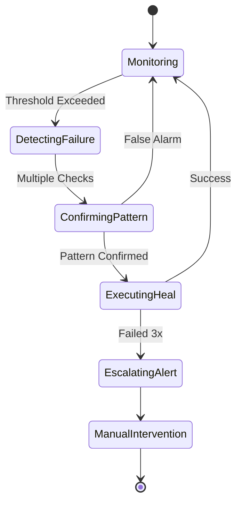

# Guardian Auto-Heal Policy — Phase G3

**Status**: Design Complete  
**Date**: 2025-10-01

## Auto-Heal Philosophy

**Principle**: Fail gracefully, recover automatically, escalate when unsafe.

- **Conservative**: Only act when failure pattern is clear
- **Safe**: Never destroy data or lose customer state
- **Audited**: Log every action for post-mortem
- **Reversible**: Auto-heal can be disabled instantly

## Failure Detection Thresholds

### /healthz Failures (Liveness)
- **Threshold**: 3 consecutive failures within 15 minutes
- **Indicates**: Application process unhealthy
- **Action**: Worker restart

### /readyz Failures (Readiness)
- **Threshold**: 2 consecutive failures within 10 minutes
- **Indicates**: Dependency unavailable
- **Action**: Disable non-critical features

### Response Time Degradation
- **Threshold**: 5 consecutive checks >3s
- **Indicates**: Resource exhaustion
- **Action**: Shed background tasks

### Circuit Breaker Opens
- **Threshold**: Immediate (no wait)
- **Indicates**: External service down
- **Action**: Activate fallback path

## Auto-Heal Actions

### Action 1: Worker Restart (Liveness Failure)

**Trigger**: `/healthz` fails 3 consecutive times

**Conditions**:
- Platform must support automatic process restart
- No in-flight critical operations (check event loop)
- Not within 5 minutes of last restart (prevent loop)

**Procedure**:
```typescript
async function handleLivenessFailure() {
  // 1. Log restart intention
  await logAutoHealAction({
    action: 'worker_restart',
    reason: 'liveness_failure',
    failureCount: 3,
    timestamp: new Date()
  });

  // 2. Graceful shutdown
  await gracefulShutdown({
    timeout: 10000, // 10s max
    drainConnections: true,
    flushLogs: true
  });

  // 3. Exit with code 1 (platform restarts)
  process.exit(1);
}
```

**Rollback**: If restart fails 3 times in 30 minutes, disable auto-heal and alert

**Safety**: Only if platform has auto-restart (Lovable does)

---

### Action 2: Disable Non-Critical Features (Readiness Failure)

**Trigger**: `/readyz` returns red status

**Affected Features**:
- Analytics collection (buffered locally)
- A/B test assignment (serve control variant)
- Lead form submissions (queue for retry)
- Dashboard live updates (serve cached data)

**Procedure**:
```typescript
async function handleReadinessFailure(failedDeps: string[]) {
  // 1. Determine impact
  const impactedFeatures = mapDependenciesToFeatures(failedDeps);
  
  // 2. Enable degraded mode
  for (const feature of impactedFeatures) {
    await featureFlags.set(feature, 'degraded', {
      reason: 'dependency_unavailable',
      dependencies: failedDeps,
      expiresIn: 600 // Auto-restore after 10 minutes
    });
  }

  // 3. Log action
  await logAutoHealAction({
    action: 'feature_degradation',
    affectedFeatures: impactedFeatures,
    dependencies: failedDeps
  });

  // 4. Alert ops team
  await sendAlert({
    severity: 'high',
    message: `Auto-heal: Disabled ${impactedFeatures.length} features`
  });
}
```

**Recovery**: Auto-restore when `/readyz` green for 3 consecutive checks

**User Impact**: Graceful degradation, no errors shown

---

### Action 3: Shed Background Tasks (Performance Degradation)

**Trigger**: Response times >3s for 5 consecutive checks

**Tasks to Pause**:
- Scheduled data cleanups
- Report generation
- Email sending (queue only)
- Non-urgent integrations

**Procedure**:
```typescript
async function handlePerformanceDegradation(avgResponseTime: number) {
  // 1. Identify background jobs
  const backgroundJobs = scheduler.listNonCriticalJobs();
  
  // 2. Pause them
  for (const job of backgroundJobs) {
    await scheduler.pause(job.id, {
      reason: 'performance_degradation',
      metric: `avg_response_${avgResponseTime}ms`,
      duration: 1800 // 30 minutes
    });
  }

  // 3. Log action
  await logAutoHealAction({
    action: 'shed_background_tasks',
    jobsPaused: backgroundJobs.length,
    avgResponseTime
  });
}
```

**Recovery**: Resume tasks when response times <2s for 10 minutes

**Safety**: Never pause user-facing operations

---

### Action 4: Activate Fallback Path (Circuit Breaker Open)

**Trigger**: Circuit breaker opens for external service

**Fallbacks by Service**:

#### Email Service (Resend)
- **Primary**: Resend API
- **Fallback**: Queue to database, retry later
- **User Impact**: Delayed email (acceptable)

#### Telephony (Twilio)
- **Primary**: Live call handling
- **Fallback**: Voicemail with SMS notification
- **User Impact**: No live answer (acceptable)

#### AI Chat (OpenAI)
- **Primary**: Real-time AI responses
- **Fallback**: Pre-scripted responses + human escalation
- **User Impact**: Reduced intelligence (acceptable)

**Procedure**:
```typescript
async function activateFallback(service: string, circuitState: string) {
  // 1. Switch to fallback mode
  await serviceRegistry.setMode(service, 'fallback', {
    reason: `circuit_${circuitState}`,
    timestamp: new Date()
  });

  // 2. Log action
  await logAutoHealAction({
    action: 'fallback_activated',
    service,
    circuitState,
    fallbackType: getFallbackType(service)
  });

  // 3. Monitor fallback health
  await startFallbackMonitoring(service);
}
```

**Recovery**: Test primary every 2 minutes (half-open), restore when 3 successes

---

### Action 5: Exponential Backoff with Jitter (Retry Logic)

**Trigger**: Any external call failure

**Formula**:
```
delay = min(maxDelay, baseDelay * 2^attempt) + random(0, jitter)
```

**Parameters**:
- `baseDelay`: 100ms
- `maxDelay`: 60s
- `jitter`: 1000ms (±1s random)
- `maxAttempts`: 5

**Procedure**:
```typescript
async function retryWithBackoff<T>(
  fn: () => Promise<T>,
  context: string
): Promise<T> {
  let attempt = 0;
  
  while (attempt < 5) {
    try {
      return await fn();
    } catch (error) {
      attempt++;
      
      if (attempt >= 5) {
        throw new Error(`${context} failed after ${attempt} attempts`);
      }
      
      // Calculate delay with jitter
      const baseDelay = 100;
      const maxDelay = 60000;
      const jitter = Math.random() * 1000;
      const delay = Math.min(
        maxDelay,
        baseDelay * Math.pow(2, attempt)
      ) + jitter;
      
      // Log retry
      await logAutoHealAction({
        action: 'retry_backoff',
        context,
        attempt,
        delayMs: delay,
        error: error.message
      });
      
      await sleep(delay);
    }
  }
}
```

**Safety**: Always use jitter to prevent thundering herd

---

## Auto-Heal State Machine



## Auto-Heal Modes

### Mode 1: DRY-RUN (Default)
- Detect failures
- Log intended actions
- **NO actual changes**
- Safe for testing

### Mode 2: ACTIVE
- Detect failures
- Execute auto-heal actions
- Log all actions
- Production mode

### Mode 3: DISABLED
- No failure detection
- No auto-heal actions
- Manual intervention only
- Emergency killswitch

**Mode Control**: Environment variable `GUARDIAN_AUTOHEAL_MODE`

## Rate Limiting & Safeguards

### Restart Rate Limit
- **Max**: 3 restarts per hour
- **Breach**: Disable auto-heal, page on-call

### Feature Disable Rate Limit
- **Max**: 5 feature disables per hour
- **Breach**: Alert ops team

### Fallback Activation Rate Limit
- **Max**: 10 fallback activations per hour per service
- **Breach**: Manual review required

### Circuit Breaker Cooldown
- **Min**: 2 minutes between half-open attempts
- **Max**: 60 minutes cooldown for repeated failures

## Audit & Observability

### Log Every Action
```typescript
interface AutoHealLog {
  id: string;
  timestamp: Date;
  action: 'restart' | 'degrade' | 'shed' | 'fallback' | 'retry';
  trigger: string;
  decision: {
    failureCount: number;
    threshold: number;
    metric: string;
  };
  outcome: 'success' | 'failed' | 'dry_run';
  metadata: Record<string, any>;
}
```

### Metrics to Track
- Auto-heal action frequency
- Success rate per action type
- Time to recovery
- False positive rate
- User impact duration

### Alerts to Send
- **Immediate**: Critical restarts, fallback activations
- **Hourly**: Summary of auto-heal actions
- **Daily**: Auto-heal effectiveness report

## Testing Strategy

### Unit Tests
- Threshold detection accuracy
- Backoff calculation correctness
- Fallback path coverage

### Integration Tests
- Full auto-heal cycle (detect → act → recover)
- Rate limit enforcement
- Mode switching

### Chaos Tests
- Kill dependencies randomly
- Simulate slow responses
- Flood with requests
- Verify graceful degradation

## Rollout Plan

### Week 1: DRY-RUN Mode
- Enable failure detection
- Log intended actions
- Verify no false positives

### Week 2: ACTIVE Mode (Restarts Only)
- Enable worker restart only
- Monitor closely

### Week 3: ACTIVE Mode (Full)
- Enable all auto-heal actions
- 24/7 monitoring

### Week 4+: Continuous Tuning
- Adjust thresholds based on data
- Add new failure patterns

## Emergency Procedures

### Disable Auto-Heal Immediately
```bash
# Set environment variable
export GUARDIAN_AUTOHEAL_MODE=disabled

# Or via database
UPDATE guardian_config 
SET value = false 
WHERE key = 'autoheal_enabled';
```

### Rollback Auto-Heal Action
```bash
# Restart disabled services
npm run guardian:restore-services

# Re-enable features
npm run guardian:restore-features
```

## Validation Checklist

✅ Failure thresholds defined  
✅ Auto-heal actions specified  
✅ Fallback paths documented  
✅ Backoff + jitter formula provided  
✅ Rate limits set  
✅ Audit logging required  
✅ DRY-RUN mode default  
✅ Emergency disable procedure  
✅ Testing strategy outlined  

**Phase G3: COMPLETE**
