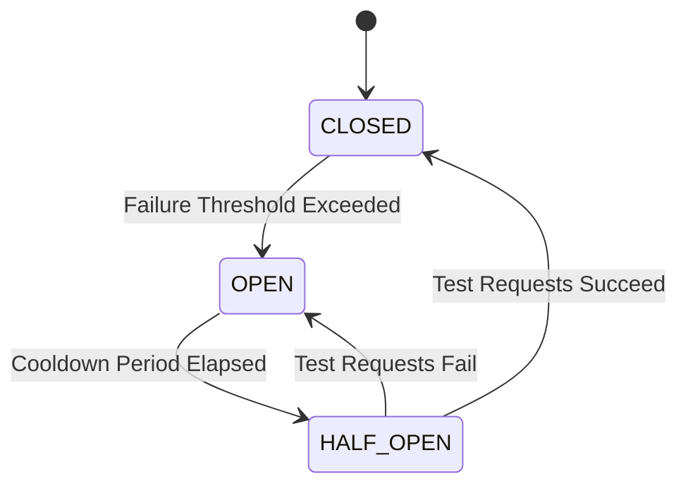

# Guardian Circuit Breakers — Phase G4

**Status**: Design Complete  
**Date**: 2025-10-01

## Circuit Breaker Pattern

**Purpose**: Prevent cascading failures by failing fast when external services are down.

**Core States**:
1. **CLOSED**: Normal operation, requests flow through
2. **OPEN**: Service failing, requests blocked, fallback activated
3. **HALF-OPEN**: Testing recovery, limited requests allowed

## State Transitions



## Circuit Breaker Configuration

### Per-Service Thresholds

#### Email Service (Resend)
- **Failure Threshold**: 5 consecutive failures OR 10 failures in 2 minutes
- **Timeout**: 5 seconds per request
- **Open Duration**: 60 seconds
- **Half-Open Probe**: Every 2 minutes
- **Half-Open Test Count**: 3 successful requests to close

#### Telephony Service (Twilio)
- **Failure Threshold**: 3 consecutive failures OR 8 failures in 5 minutes
- **Timeout**: 10 seconds per request
- **Open Duration**: 120 seconds
- **Half-Open Probe**: Every 5 minutes
- **Half-Open Test Count**: 2 successful requests to close

#### AI Service (OpenAI)
- **Failure Threshold**: 5 consecutive failures OR 15 failures in 5 minutes
- **Timeout**: 30 seconds per request
- **Open Duration**: 180 seconds
- **Half-Open Probe**: Every 3 minutes
- **Half-Open Test Count**: 3 successful requests to close

#### Database (Supabase)
- **Failure Threshold**: 2 consecutive failures OR 5 failures in 1 minute
- **Timeout**: 3 seconds per query
- **Open Duration**: 30 seconds
- **Half-Open Probe**: Every 1 minute
- **Half-Open Test Count**: 5 successful requests to close

## Circuit Breaker Implementation

### Core Interface
```typescript
interface CircuitBreaker {
  state: 'CLOSED' | 'OPEN' | 'HALF_OPEN';
  failureCount: number;
  successCount: number;
  lastFailureTime: Date | null;
  lastSuccessTime: Date | null;
  openedAt: Date | null;
  nextProbeAt: Date | null;
}

interface CircuitBreakerConfig {
  name: string;
  failureThreshold: number;      // Consecutive failures to open
  failureWindowMs: number;        // Time window for counting failures
  failureWindowThreshold: number; // Max failures in window
  timeoutMs: number;              // Request timeout
  openDurationMs: number;         // How long to stay open
  probeIntervalMs: number;        // Half-open probe interval
  halfOpenSuccesses: number;      // Successes needed to close
}
```

### State Management
```typescript
class CircuitBreakerManager {
  private breakers: Map<string, CircuitBreaker> = new Map();
  private config: Map<string, CircuitBreakerConfig> = new Map();

  async execute<T>(
    serviceName: string,
    operation: () => Promise<T>,
    fallback?: () => Promise<T>
  ): Promise<T> {
    const breaker = this.getBreaker(serviceName);
    const cfg = this.config.get(serviceName);

    // Check state
    if (breaker.state === 'OPEN') {
      // Check if cooldown expired
      if (Date.now() >= breaker.nextProbeAt!.getTime()) {
        breaker.state = 'HALF_OPEN';
        await this.logStateChange(serviceName, 'HALF_OPEN');
      } else {
        // Still open, use fallback
        if (fallback) {
          return await fallback();
        }
        throw new Error(`Circuit breaker OPEN for ${serviceName}`);
      }
    }

    // Execute request with timeout
    try {
      const result = await this.withTimeout(
        operation(),
        cfg!.timeoutMs
      );

      // Success
      await this.recordSuccess(serviceName);
      return result;

    } catch (error) {
      // Failure
      await this.recordFailure(serviceName, error);

      // Use fallback if available
      if (fallback) {
        return await fallback();
      }
      throw error;
    }
  }

  private async recordSuccess(serviceName: string): Promise<void> {
    const breaker = this.getBreaker(serviceName);
    const cfg = this.config.get(serviceName)!;

    breaker.successCount++;
    breaker.lastSuccessTime = new Date();

    if (breaker.state === 'HALF_OPEN') {
      // Check if enough successes to close
      if (breaker.successCount >= cfg.halfOpenSuccesses) {
        breaker.state = 'CLOSED';
        breaker.failureCount = 0;
        breaker.successCount = 0;
        await this.logStateChange(serviceName, 'CLOSED');
      }
    } else if (breaker.state === 'CLOSED') {
      // Reset failure count on success
      breaker.failureCount = 0;
    }
  }

  private async recordFailure(serviceName: string, error: any): Promise<void> {
    const breaker = this.getBreaker(serviceName);
    const cfg = this.config.get(serviceName)!;

    breaker.failureCount++;
    breaker.lastFailureTime = new Date();

    // Check if should open
    const shouldOpen = 
      breaker.failureCount >= cfg.failureThreshold ||
      await this.checkFailureWindow(serviceName, cfg);

    if (shouldOpen && breaker.state !== 'OPEN') {
      breaker.state = 'OPEN';
      breaker.openedAt = new Date();
      breaker.nextProbeAt = new Date(Date.now() + cfg.openDurationMs);
      breaker.successCount = 0;
      
      await this.logStateChange(serviceName, 'OPEN', error);
      await this.notifyCircuitOpen(serviceName);
    }
  }

  private async checkFailureWindow(
    serviceName: string,
    cfg: CircuitBreakerConfig
  ): Promise<boolean> {
    // Query recent failure events from database
    const recentFailures = await this.getRecentFailures(
      serviceName,
      cfg.failureWindowMs
    );
    return recentFailures.length >= cfg.failureWindowThreshold;
  }
}
```

## Fallback Strategies

### Email Service Fallback
```typescript
async function sendEmailWithFallback(email: EmailPayload) {
  return await circuitBreaker.execute(
    'resend',
    // Primary: Resend API
    async () => {
      return await resendClient.emails.send(email);
    },
    // Fallback: Queue for later
    async () => {
      await emailQueue.add(email, {
        delay: 60000, // Retry in 1 minute
        attempts: 5,
        backoff: { type: 'exponential', delay: 60000 }
      });
      return { id: 'queued', status: 'queued' };
    }
  );
}
```

### Telephony Service Fallback
```typescript
async function handleIncomingCall(callSid: string, from: string) {
  return await circuitBreaker.execute(
    'twilio',
    // Primary: Live AI handling
    async () => {
      return await twilioClient.calls(callSid).update({
        twiml: await generateAIResponse(from)
      });
    },
    // Fallback: Voicemail + SMS
    async () => {
      await twilioClient.calls(callSid).update({
        twiml: '<Response><Say>Please leave a message.</Say><Record/></Response>'
      });
      await twilioClient.messages.create({
        to: from,
        from: TWILIO_NUMBER,
        body: 'We received your call. Someone will call you back shortly.'
      });
      return { status: 'voicemail' };
    }
  );
}
```

### AI Service Fallback
```typescript
async function getChatResponse(message: string, context: any) {
  return await circuitBreaker.execute(
    'openai',
    // Primary: OpenAI API
    async () => {
      return await openai.chat.completions.create({
        model: 'gpt-4',
        messages: [{ role: 'user', content: message }]
      });
    },
    // Fallback: Pre-scripted responses
    async () => {
      const scriptedResponse = matchScriptedResponse(message, context);
      if (scriptedResponse) {
        return { response: scriptedResponse, source: 'scripted' };
      }
      // Escalate to human
      await escalateToHuman(context);
      return { 
        response: 'Let me connect you with a team member.', 
        source: 'human_escalation' 
      };
    }
  );
}
```

### Database Fallback
```typescript
async function queryWithFallback<T>(query: string, params: any[]) {
  return await circuitBreaker.execute(
    'supabase',
    // Primary: Live database
    async () => {
      return await supabase.rpc(query, params);
    },
    // Fallback: Cached data
    async () => {
      const cached = await redis.get(`cache:${query}:${JSON.stringify(params)}`);
      if (cached) {
        return { data: JSON.parse(cached), source: 'cache' };
      }
      throw new Error('No cached data available');
    }
  );
}
```

## Monitoring & Observability

### Metrics to Track
```typescript
interface CircuitBreakerMetrics {
  serviceName: string;
  state: 'CLOSED' | 'OPEN' | 'HALF_OPEN';
  failureCount: number;
  successCount: number;
  openCount: number;        // How many times opened
  halfOpenCount: number;    // How many times half-opened
  avgTimeInOpen: number;    // Average duration in OPEN state
  avgTimeToRecover: number; // Average time from OPEN to CLOSED
  fallbackUsageRate: number; // % of requests using fallback
  lastOpenReason: string;
}
```

### Dashboard Displays
- Current state per service (visual indicator)
- Failure rate over time (chart)
- Time in OPEN state (duration)
- Fallback usage frequency (counter)
- Recovery success rate (%)

### Alerts
- **CRITICAL**: Database circuit opens
- **HIGH**: Any circuit opens >5 minutes
- **MEDIUM**: Circuit opens 3+ times in 1 hour
- **LOW**: Half-open probe failures

## Testing Strategy

### Unit Tests
```typescript
describe('CircuitBreaker', () => {
  it('opens after consecutive failures', async () => {
    // Simulate 5 failures
    for (let i = 0; i < 5; i++) {
      await expect(breaker.execute('test', failingOp)).rejects.toThrow();
    }
    expect(breaker.getState('test')).toBe('OPEN');
  });

  it('transitions to half-open after cooldown', async () => {
    // Open circuit
    await openCircuit('test');
    
    // Wait for cooldown
    await sleep(COOLDOWN_MS);
    
    // Next call should trigger half-open
    await breaker.execute('test', successOp);
    expect(breaker.getState('test')).toBe('HALF_OPEN');
  });

  it('closes after successful half-open probes', async () => {
    await setHalfOpen('test');
    
    // 3 successful probes
    for (let i = 0; i < 3; i++) {
      await breaker.execute('test', successOp);
    }
    
    expect(breaker.getState('test')).toBe('CLOSED');
  });

  it('uses fallback when open', async () => {
    await openCircuit('test');
    
    const result = await breaker.execute(
      'test',
      failingOp,
      () => Promise.resolve('fallback')
    );
    
    expect(result).toBe('fallback');
  });
});
```

### Integration Tests
- Simulate external service outage
- Verify fallback activation
- Confirm recovery process
- Test concurrent requests during state transitions

### Load Tests
- High request volume with intermittent failures
- Verify no thundering herd on recovery
- Confirm fallback capacity

## Configuration Examples

### Development Environment
```typescript
const devConfig: CircuitBreakerConfig = {
  name: 'openai',
  failureThreshold: 2,           // Fail fast in dev
  failureWindowMs: 30000,
  failureWindowThreshold: 5,
  timeoutMs: 5000,
  openDurationMs: 10000,         // Short cooldown
  probeIntervalMs: 30000,
  halfOpenSuccesses: 1
};
```

### Production Environment
```typescript
const prodConfig: CircuitBreakerConfig = {
  name: 'openai',
  failureThreshold: 5,           // More tolerant
  failureWindowMs: 120000,
  failureWindowThreshold: 15,
  timeoutMs: 30000,
  openDurationMs: 180000,        // Long cooldown
  probeIntervalMs: 180000,
  halfOpenSuccesses: 3
};
```

## Emergency Procedures

### Force Open Circuit
```typescript
// Manually open circuit for maintenance
await circuitBreaker.forceOpen('twilio', {
  reason: 'scheduled_maintenance',
  duration: 3600000 // 1 hour
});
```

### Force Close Circuit
```typescript
// Manually close circuit after verification
await circuitBreaker.forceClose('twilio', {
  reason: 'verified_healthy',
  resetCounters: true
});
```

### Disable Circuit Breaker
```typescript
// Emergency disable (pass-through mode)
await circuitBreaker.disable('twilio', {
  reason: 'emergency_override',
  bypassFallback: true
});
```

## Validation Checklist

✅ State machine defined (CLOSED, OPEN, HALF_OPEN)  
✅ Per-service thresholds configured  
✅ Timeout values set  
✅ Cooldown periods specified  
✅ Fallback strategies documented  
✅ Monitoring metrics defined  
✅ Testing strategy outlined  
✅ Emergency procedures provided  

**Phase G4: COMPLETE**
