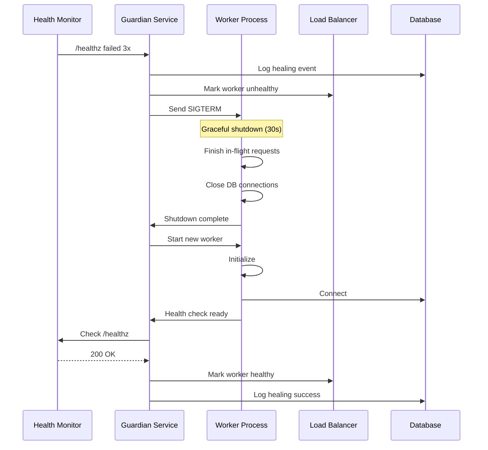
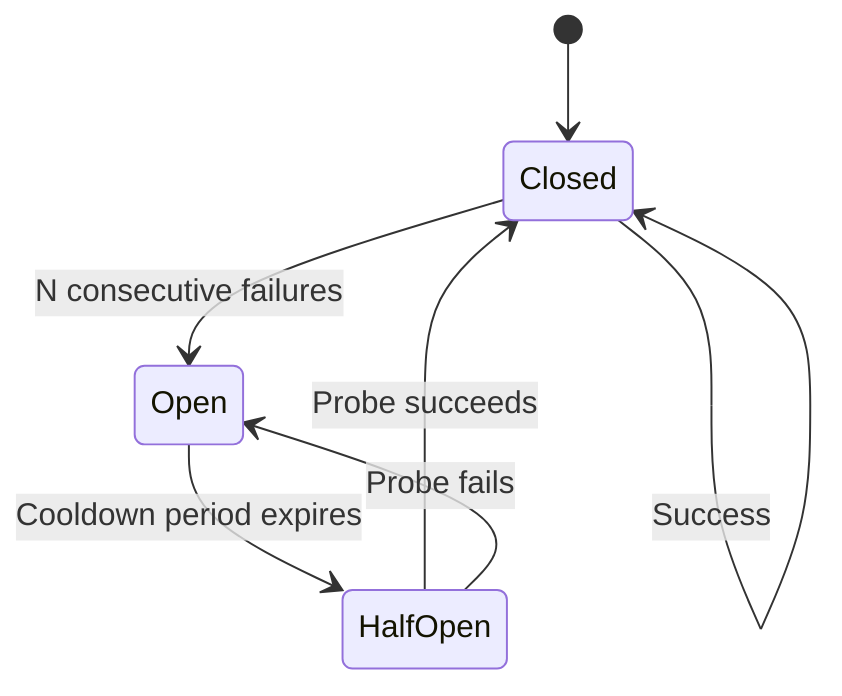

# Phase GG3 — Auto-Heal & Circuit-Breaker Scenarios

## Verification Date
2025-10-01

## Purpose
Document failure playbooks for auto-healing actions and circuit breaker scenarios. Design only—no implementation or enablement.

---

## Auto-Healing Framework

### Healing Principles
1. **Detect early**: Catch issues before user impact
2. **Act automatically**: No human intervention for known issues
3. **Rollback if worse**: Healing action should not degrade service
4. **Log everything**: Full audit trail of healing actions
5. **Alert on repeated heals**: Pattern indicates systemic issue

---

## Auto-Heal Playbook 1: Worker Restart

### Trigger Conditions
| Condition ID | Condition | Threshold | Severity |
|-------------|-----------|-----------|----------|
| AH-01 | `/healthz` consecutive failures | 3 in a row | Critical |
| AH-02 | Event loop lag critical | ≥ 100ms for 3 checks | Critical |
| AH-03 | Memory usage critical | Heap ≥ 95% | Critical |
| AH-04 | Unhandled exception rate | ≥ 5 per minute | High |

### Decision Matrix

```
IF /healthz fails 3 consecutive times THEN
  Log critical event
  Alert on-call
  Execute worker restart
  Monitor post-restart health
END IF

IF event_loop_lag > 100ms for 3 consecutive checks THEN
  Log critical event
  Alert on-call
  Execute worker restart
  Monitor post-restart health
END IF

IF heap_usage >= 95% THEN
  Log critical event
  Alert on-call
  Execute immediate worker restart
  Investigate memory leak
END IF
```

### Restart Sequence



### Restart Command (Conceptual)
```bash
# Not actual implementation
guardian-heal restart-worker \
  --reason="healthz_consecutive_failures" \
  --graceful-timeout=30s \
  --max-retries=3 \
  --alert-oncall=true
```

### Post-Restart Validation
```yaml
validation_steps:
  - step: wait_for_process
    timeout: 10s
    
  - step: check_healthz
    retries: 3
    expected: 200 OK
    
  - step: check_readyz
    retries: 3
    expected: 200 OK
    
  - step: verify_connections
    checks:
      - database: connected
      - auth: connected
      - storage: connected
      
  - step: restore_to_lb
    condition: all_checks_pass
```

### Restart Failure Handling
```
IF worker restart fails THEN
  Retry up to 3 times
  IF still failing THEN
    Page on-call immediately
    Mark node unhealthy
    Route traffic to other nodes
    Create critical incident
  END IF
END IF
```

---

## Auto-Heal Playbook 2: Disable Non-Critical Integrations

### Trigger Conditions
| Condition ID | Condition | Threshold | Severity |
|-------------|-----------|-----------|----------|
| AH-05 | `/readyz` failing due to storage | 5 consecutive failures | Medium |
| AH-06 | External API circuit open | Any circuit open for > 10 min | Medium |
| AH-07 | Rate limit warning | Utilization ≥ 85% | Medium |

### Disablement Strategy

```typescript
// Conceptual graceful degradation (not actual code)
interface IntegrationState {
  name: string;
  critical: boolean;
  enabled: boolean;
  fallback_mode?: string;
}

const integrations: IntegrationState[] = [
  { name: "database", critical: true, enabled: true },
  { name: "auth", critical: true, enabled: true },
  { name: "storage", critical: false, enabled: true, fallback_mode: "local_cache" },
  { name: "openai", critical: false, enabled: true, fallback_mode: "canned_responses" },
  { name: "twilio", critical: false, enabled: true, fallback_mode: "queue_for_retry" },
  { name: "resend", critical: false, enabled: true, fallback_mode: "queue_for_retry" }
];

function disableNonCriticalIntegration(name: string): void {
  const integration = integrations.find(i => i.name === name);
  
  if (!integration.critical) {
    integration.enabled = false;
    enableFallbackMode(integration.fallback_mode);
    logHealingAction("disable_integration", name);
    alertOpsTeam("Integration disabled", name);
  }
}
```

### Fallback Modes

#### Storage Fallback
```yaml
integration: storage
degradation_mode: local_cache
behavior:
  - reads: serve from local cache (5 min TTL)
  - writes: queue for later upload
  - user_impact: minimal (cached content may be stale)
  - recovery: re-enable when storage healthz passes
```

#### OpenAI Fallback
```yaml
integration: openai
degradation_mode: canned_responses
behavior:
  - requests: return pre-defined responses
  - quality: lower (generic answers)
  - user_impact: moderate (less personalized)
  - recovery: re-enable when circuit closes
```

#### Twilio Fallback
```yaml
integration: twilio
degradation_mode: queue_for_retry
behavior:
  - calls: store in retry queue
  - retry: every 5 minutes for 2 hours
  - user_impact: high (calls delayed)
  - recovery: re-enable when circuit closes
```

### Re-Enablement Criteria
```
FOR EACH disabled integration DO
  IF integration.healthz returns 200 OK THEN
    IF circuit_breaker is closed THEN
      Re-enable integration
      Exit fallback mode
      Log healing success
      Alert ops team
    END IF
  END IF
END FOR
```

---

## Circuit Breaker Pattern

### Circuit States



### State Definitions

#### Closed State
- **Description**: Normal operation, requests pass through
- **Failure counting**: Tracks consecutive failures
- **Transition to Open**: After N consecutive failures (configurable per provider)

#### Open State
- **Description**: Circuit tripped, requests fail fast without calling provider
- **Duration**: Cooldown period (configurable, default 60s)
- **Behavior**: Return cached data or fallback response
- **Transition to Half-Open**: After cooldown expires

#### Half-Open State
- **Description**: Testing if provider recovered
- **Behavior**: Allow 1 probe request through
- **Success**: Transition back to Closed
- **Failure**: Transition back to Open with extended cooldown

---

## Circuit Breaker Configuration

### Provider: OpenAI
```yaml
provider: openai
circuit_breaker:
  failure_threshold: 5
  timeout_threshold_ms: 10000
  cooldown_period_seconds: 60
  half_open_max_requests: 1
  success_threshold_to_close: 3
  
failure_conditions:
  - status_code: [500, 502, 503, 504]
  - timeout: > 10s
  - connection_error: true
  
fallback_strategy:
  type: canned_responses
  cache_ttl: 300s
```

### Provider: Twilio
```yaml
provider: twilio
circuit_breaker:
  failure_threshold: 10
  timeout_threshold_ms: 5000
  cooldown_period_seconds: 120
  half_open_max_requests: 1
  success_threshold_to_close: 5
  
failure_conditions:
  - status_code: [500, 502, 503, 504, 429]
  - timeout: > 5s
  - connection_error: true
  
fallback_strategy:
  type: queue_for_retry
  max_queue_size: 1000
  retry_interval_seconds: 300
```

### Provider: Resend
```yaml
provider: resend
circuit_breaker:
  failure_threshold: 5
  timeout_threshold_ms: 3000
  cooldown_period_seconds: 60
  half_open_max_requests: 1
  success_threshold_to_close: 3
  
failure_conditions:
  - status_code: [500, 502, 503, 504, 429]
  - timeout: > 3s
  - connection_error: true
  
fallback_strategy:
  type: queue_for_retry
  max_queue_size: 500
  retry_interval_seconds: 180
```

---

## Circuit Breaker State Machine

### State Transition Logic

```typescript
// Conceptual implementation (not actual code)
interface CircuitBreakerState {
  provider: string;
  state: "closed" | "open" | "half_open";
  consecutive_failures: number;
  last_failure_at: Date | null;
  cooldown_expires_at: Date | null;
  half_open_attempts: number;
}

class CircuitBreaker {
  private state: CircuitBreakerState;
  
  async executeRequest(request: () => Promise<Response>): Promise<Response> {
    // Check current state
    if (this.state.state === "open") {
      if (Date.now() > this.state.cooldown_expires_at) {
        this.transitionToHalfOpen();
      } else {
        return this.fallbackResponse();
      }
    }
    
    // Execute request
    try {
      const response = await request();
      this.onSuccess(response);
      return response;
    } catch (error) {
      this.onFailure(error);
      return this.fallbackResponse();
    }
  }
  
  private onSuccess(response: Response): void {
    if (this.state.state === "half_open") {
      this.transitionToClosed();
    } else {
      this.state.consecutive_failures = 0;
    }
  }
  
  private onFailure(error: Error): void {
    this.state.consecutive_failures++;
    this.state.last_failure_at = new Date();
    
    if (this.state.consecutive_failures >= this.config.failure_threshold) {
      this.transitionToOpen();
    }
  }
  
  private transitionToOpen(): void {
    this.state.state = "open";
    this.state.cooldown_expires_at = new Date(Date.now() + this.config.cooldown_period_seconds * 1000);
    this.logStateChange("open");
    this.alertOpsTeam("circuit_breaker_opened", this.state.provider);
  }
  
  private transitionToHalfOpen(): void {
    this.state.state = "half_open";
    this.state.half_open_attempts = 0;
    this.logStateChange("half_open");
  }
  
  private transitionToClosed(): void {
    this.state.state = "closed";
    this.state.consecutive_failures = 0;
    this.state.last_failure_at = null;
    this.logStateChange("closed");
    this.alertOpsTeam("circuit_breaker_closed", this.state.provider);
  }
}
```

---

## Exponential Backoff with Jitter

### Backoff Algorithm

```typescript
// Conceptual implementation (not actual code)
interface BackoffConfig {
  initial_delay_ms: number;
  max_delay_ms: number;
  multiplier: number;
  jitter_range: number;
}

function calculateBackoff(attempt: number, config: BackoffConfig): number {
  // Base exponential backoff
  const baseDelay = Math.min(
    config.initial_delay_ms * Math.pow(config.multiplier, attempt),
    config.max_delay_ms
  );
  
  // Add jitter (±jitter_range%)
  const jitterAmount = baseDelay * config.jitter_range / 100;
  const jitter = (Math.random() * 2 - 1) * jitterAmount;
  
  return Math.max(0, baseDelay + jitter);
}

// Example: OpenAI retry backoff
const openAIBackoff: BackoffConfig = {
  initial_delay_ms: 1000,   // 1 second
  max_delay_ms: 60000,      // 60 seconds
  multiplier: 2,            // Double each attempt
  jitter_range: 25          // ±25%
};

// Backoff sequence example:
// Attempt 1: 1000ms ± 250ms = 750-1250ms
// Attempt 2: 2000ms ± 500ms = 1500-2500ms
// Attempt 3: 4000ms ± 1000ms = 3000-5000ms
// Attempt 4: 8000ms ± 2000ms = 6000-10000ms
// Attempt 5: 16000ms ± 4000ms = 12000-20000ms
// Attempt 6+: 60000ms ± 15000ms = 45000-75000ms (capped)
```

### Backoff Configuration by Provider

| Provider | Initial Delay | Max Delay | Multiplier | Jitter | Max Retries |
|----------|--------------|-----------|------------|--------|-------------|
| OpenAI | 1000ms | 60000ms | 2x | ±25% | 5 |
| Twilio | 500ms | 30000ms | 2x | ±20% | 7 |
| Resend | 1000ms | 45000ms | 2x | ±25% | 5 |
| Database | 100ms | 5000ms | 2x | ±15% | 10 |
| Storage | 500ms | 15000ms | 2x | ±20% | 5 |

---

## Half-Open Probe Strategy

### Probe Request Design

```typescript
// Conceptual probe implementation (not actual code)
interface ProbeRequest {
  provider: string;
  request_type: "health_check" | "lightweight_operation";
  timeout_ms: number;
  expected_response: any;
}

async function executeProbe(probe: ProbeRequest): Promise<boolean> {
  console.log(`[Circuit Breaker] Probing ${probe.provider}...`);
  
  try {
    const startTime = Date.now();
    const response = await makeProbeRequest(probe);
    const duration = Date.now() - startTime;
    
    const success = 
      response.status === probe.expected_response.status &&
      duration < probe.timeout_ms;
    
    console.log(`[Circuit Breaker] Probe ${success ? 'SUCCESS' : 'FAILED'} (${duration}ms)`);
    
    return success;
  } catch (error) {
    console.error(`[Circuit Breaker] Probe error: ${error.message}`);
    return false;
  }
}
```

### Probe Definitions

#### OpenAI Probe
```yaml
provider: openai
probe:
  type: lightweight_operation
  request:
    endpoint: /v1/models
    method: GET
  timeout_ms: 3000
  expected_response:
    status: 200
```

#### Twilio Probe
```yaml
provider: twilio
probe:
  type: health_check
  request:
    endpoint: /2010-04-01/Accounts/{AccountSid}
    method: GET
  timeout_ms: 2000
  expected_response:
    status: 200
```

#### Resend Probe
```yaml
provider: resend
probe:
  type: health_check
  request:
    endpoint: /emails
    method: GET
    params:
      limit: 1
  timeout_ms: 2000
  expected_response:
    status: 200
```

---

## Healing Playbook 3: Database Connection Pool Scaling

### Trigger Conditions
| Condition ID | Condition | Threshold | Severity |
|-------------|-----------|-----------|----------|
| AH-08 | Available connections low | < 5 available | Medium |
| AH-09 | Available connections critical | < 2 available | High |
| AH-10 | Connection acquisition timeout | > 5s wait time | High |

### Auto-Scaling Logic

```typescript
// Conceptual pool scaling (not actual code)
interface PoolConfig {
  min_connections: number;
  max_connections: number;
  current_size: number;
  available: number;
  scale_up_threshold: number;
  scale_down_threshold: number;
}

function evaluatePoolScaling(pool: PoolConfig): void {
  const availablePercent = (pool.available / pool.current_size) * 100;
  
  // Scale up if low availability
  if (availablePercent < pool.scale_up_threshold && pool.current_size < pool.max_connections) {
    const newSize = Math.min(pool.current_size + 5, pool.max_connections);
    scalePoolUp(newSize);
    logHealingAction("scale_pool_up", { from: pool.current_size, to: newSize });
  }
  
  // Scale down if over-provisioned
  if (availablePercent > pool.scale_down_threshold && pool.current_size > pool.min_connections) {
    const newSize = Math.max(pool.current_size - 2, pool.min_connections);
    scalePoolDown(newSize);
    logHealingAction("scale_pool_down", { from: pool.current_size, to: newSize });
  }
}

// Configuration
const poolConfig: PoolConfig = {
  min_connections: 5,
  max_connections: 50,
  current_size: 10,
  available: 3,
  scale_up_threshold: 30,    // Scale up if < 30% available
  scale_down_threshold: 80   // Scale down if > 80% available
};
```

---

## Healing Event Logging

### Log Schema
```sql
-- Conceptual schema (not actual implementation)
CREATE TABLE healing_events (
  id UUID PRIMARY KEY DEFAULT gen_random_uuid(),
  event_type TEXT NOT NULL,
  component TEXT NOT NULL,
  trigger_condition TEXT NOT NULL,
  action_taken TEXT NOT NULL,
  action_params JSONB,
  success BOOLEAN NOT NULL,
  error_message TEXT,
  created_at TIMESTAMP WITH TIME ZONE NOT NULL DEFAULT NOW()
);

-- Index for querying recent healing events
CREATE INDEX idx_healing_events_created_at 
  ON healing_events(created_at DESC);
```

### Example Healing Event
```json
{
  "id": "heal_a1b2c3d4-e5f6-7890",
  "event_type": "worker_restart",
  "component": "worker_process_01",
  "trigger_condition": "healthz_consecutive_failures",
  "action_taken": "graceful_restart",
  "action_params": {
    "consecutive_failures": 3,
    "last_failure_at": "2025-10-01T00:10:00.000Z",
    "graceful_timeout_seconds": 30
  },
  "success": true,
  "error_message": null,
  "created_at": "2025-10-01T00:10:05.000Z"
}
```

---

## Healing Metrics & Monitoring

| Metric | Description | Alert Threshold |
|--------|-------------|----------------|
| `healing_events_total` | Count of healing events | N/A |
| `healing_events_by_type` | Count by event type | N/A |
| `healing_success_rate` | % of successful healing actions | < 90% |
| `circuit_breakers_open` | Number of open circuit breakers | > 2 |
| `worker_restart_frequency` | Restarts per hour | > 3 |
| `fallback_mode_duration` | Time in fallback mode | > 30 min |

---

## Validation Checklist

| Item | Status | Notes |
|------|--------|-------|
| Worker restart triggers defined | ✅ | Healthz failures, memory, event loop |
| Restart sequence documented | ✅ | Graceful shutdown, validation, LB restore |
| Non-critical integration disablement | ✅ | Storage, OpenAI, Twilio, Resend |
| Fallback modes specified | ✅ | Cache, canned responses, queue |
| Circuit breaker states defined | ✅ | Closed, Open, Half-Open |
| Circuit breaker configs complete | ✅ | Per-provider thresholds and cooldowns |
| Exponential backoff with jitter | ✅ | Per-provider backoff configs |
| Half-open probe strategy | ✅ | Lightweight health checks |
| Database pool auto-scaling | ✅ | Scale up/down thresholds |
| Healing event logging designed | ✅ | Schema, example events |
| Monitoring metrics identified | ✅ | Success rates, frequencies, durations |

---

## Status: ✅ AUTO-HEAL & CIRCUIT-BREAKER PLAYBOOK COMPLETE

**Date:** 2025-10-01  
**Next Phase:** GG4 - Final Guardian Readiness

Auto-healing playbooks and circuit breaker scenarios fully documented. Worker restart, integration disablement, exponential backoff, and probe strategies specified. Design only—no implementation or enablement performed.
