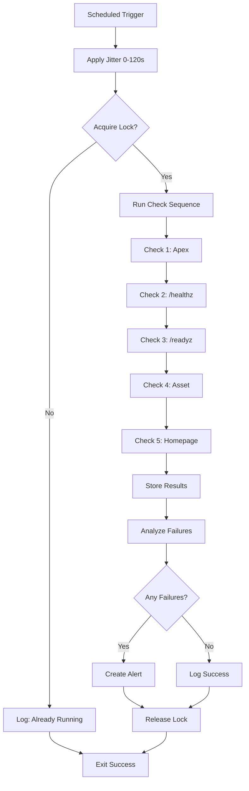

# Guardian Synthetic Checks — Phase G2

**Status**: Design Complete  
**Date**: 2025-10-01

## Schedule Design

**Base Interval**: Every 6 minutes  
**Jitter**: ±60 seconds (random offset)  
**Effective Range**: 5-7 minutes between runs  
**Rationale**: Prevents overlapping checks, distributes load, avoids fixed-interval detection

### Cron Expression (GitHub Actions)
```yaml
schedule:
  - cron: '*/6 * * * *'  # Every 6 minutes base
```

**Runtime Jitter**: Add random 0-120s delay at job start

## Check Targets

### 1. Apex Domain
- **URL**: `https://555a4971-4138-435e-a7ee-dfa3d713d1d3.lovableproject.com`
- **Method**: GET
- **Timeout**: 5s
- **Expected**: 200 OK
- **Validates**: DNS, TLS, CDN routing

### 2. Health Endpoint
- **URL**: `https://555a4971-4138-435e-a7ee-dfa3d713d1d3.lovableproject.com/healthz`
- **Method**: GET
- **Timeout**: 3s
- **Expected**: `{"status": "healthy"}`
- **Validates**: Application liveness

### 3. Readiness Endpoint
- **URL**: `https://555a4971-4138-435e-a7ee-dfa3d713d1d3.lovableproject.com/readyz`
- **Method**: GET
- **Timeout**: 3s
- **Expected**: `{"ready": true}`
- **Validates**: Dependency availability

### 4. Key Static Asset
- **URL**: `https://555a4971-4138-435e-a7ee-dfa3d713d1d3.lovableproject.com/assets/official-logo.svg`
- **Method**: GET
- **Timeout**: 3s
- **Expected**: 200 OK, content-type: image/svg+xml
- **Validates**: Asset delivery pipeline

### 5. Homepage
- **URL**: `https://555a4971-4138-435e-a7ee-dfa3d713d1d3.lovableproject.com/`
- **Method**: GET
- **Timeout**: 5s
- **Expected**: 200 OK, contains `#root`
- **Validates**: Full page render capability

## Concurrency Control

**Single Concurrency Key**: `synthetic_check_runner`

### Mechanism
```typescript
// Distributed lock approach (PostgreSQL advisory lock or Redis)
const lockKey = 'synthetic_check_runner';
const workerId = crypto.randomUUID();
const lockTTL = 600; // 10 minutes max runtime

// Acquire lock
const acquired = await acquireLock(lockKey, workerId, lockTTL);
if (!acquired) {
  console.log('Check already running, skipping...');
  return;
}

try {
  // Perform all checks
  await runSyntheticChecks();
} finally {
  // Always release lock
  await releaseLock(lockKey, workerId);
}
```

### Lock Behavior
- **Acquire**: Attempt to acquire lock at job start
- **Skip**: If lock held, log and exit gracefully (no failure)
- **TTL**: 10-minute max lock duration (prevents deadlock)
- **Release**: Always release on completion or error

## Concurrency Scenarios

### Scenario 1: Normal Operation
```
T+0m:  Job A starts → acquires lock → runs checks → releases lock (completes in 30s)
T+6m:  Job B starts → acquires lock → runs checks → releases lock
```

### Scenario 2: Long-Running Check
```
T+0m:  Job A starts → acquires lock → slow network (takes 8m)
T+6m:  Job B starts → lock held → skips gracefully
T+8m:  Job A completes → releases lock
T+12m: Job C starts → acquires lock → runs normally
```

### Scenario 3: Worker Crash
```
T+0m:  Job A starts → acquires lock → crashes mid-check
T+6m:  Job B starts → lock held → skips
T+10m: Lock TTL expires automatically
T+12m: Job C starts → acquires lock → runs normally
```

### Scenario 4: Multiple Workers Start Simultaneously
```
T+0m:  Job A starts → attempts lock
T+0m:  Job B starts → attempts lock
Result: Only ONE acquires lock (atomic operation), other skips
```

## Check Execution Flow



## Result Storage

```typescript
interface SyntheticCheckResult {
  checkRunId: string;        // Unique per scheduled run
  targetId: string;          // apex, healthz, readyz, asset, homepage
  targetUrl: string;
  timestamp: Date;
  success: boolean;
  statusCode: number | null;
  responseTimeMs: number;
  errorMessage: string | null;
  validationResults: {
    sslValid?: boolean;
    contentTypeMatch?: boolean;
    jsonFieldsPresent?: boolean;
    domElementsPresent?: boolean;
  };
}
```

**Storage**: `guardian_synthetic_checks` table (already exists)

## Alerting Rules

### 1. Apex Domain Unreachable
- **Trigger**: apex check fails 2 consecutive times
- **Severity**: CRITICAL
- **Action**: Page on-call

### 2. Health Endpoints Failing
- **Trigger**: /healthz OR /readyz fails 3 consecutive times
- **Severity**: HIGH
- **Action**: Send email alert

### 3. Slow Response Times
- **Trigger**: Any check >3s response time for 5 consecutive runs
- **Severity**: MEDIUM
- **Action**: Create ticket

### 4. Asset Loading Failure
- **Trigger**: Asset check fails 2 consecutive times
- **Severity**: LOW
- **Action**: Log only

## Monitoring Dashboard

Display metrics:
- Check success rate (last 24h)
- Average response time per target
- Check frequency (actual vs expected)
- Consecutive failures per target
- Lock contention events
- Check duration histogram

## Failure Scenarios & Handling

### All Targets Unreachable
- **Likely Cause**: CDN outage, DNS failure
- **Action**: Immediate critical alert
- **Auto-Heal**: Attempt to purge CDN cache

### Single Target Slow
- **Likely Cause**: Backend degradation
- **Action**: Medium alert
- **Auto-Heal**: None (investigate first)

### Lock Never Acquired (3+ consecutive)
- **Likely Cause**: Lock service failure
- **Action**: High alert
- **Auto-Heal**: Reset lock table

### Check Job Timeout (>10m)
- **Likely Cause**: Network partition
- **Action**: Worker restart
- **Auto-Heal**: Kill worker, release lock

## Rollout Plan

### Phase 1: Shadow Mode (Week 1)
- Run checks, store results, NO alerts
- Validate check accuracy
- Tune timeout values

### Phase 2: Alert Testing (Week 2)
- Enable alerts to test channels only
- Verify no false positives
- Adjust thresholds

### Phase 3: Production Alerts (Week 3)
- Enable full alerting
- Monitor for 1 week

### Phase 4: Full Automation (Week 4+)
- Enable auto-heal actions
- Continuous monitoring

## Cost & Resource Estimates

- **Compute**: ~10 checks/hour × 24h = 240 requests/day
- **Network**: ~5 targets × 240 runs = 1,200 HTTP requests/day
- **Storage**: ~5 rows × 240 runs = 1,200 rows/day (~100KB/day)
- **Estimated Cost**: <$1/month (GitHub Actions free tier)

## Validation Checklist

✅ Schedule defined with jitter  
✅ Concurrency key specified  
✅ All 5 targets documented  
✅ Timeout values set  
✅ Lock TTL prevents deadlock  
✅ Failure handling specified  
✅ Alerting rules defined  
✅ Storage schema exists  
✅ Cost estimated  

**Phase G2: COMPLETE**
