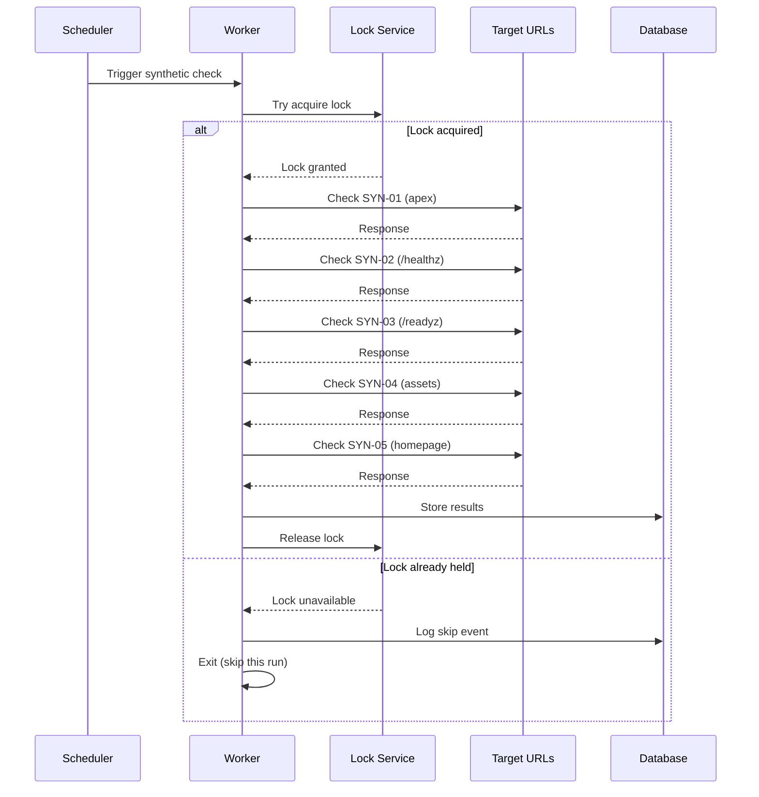

# Phase GG2 — Synthetic Schedule & Concurrency Plan

## Verification Date
2025-10-01

## Purpose
Propose a non-overlapping synthetic check schedule with jitter and a single concurrency key to prevent overlapping runs. Design only—no implementation or enablement.

---

## Synthetic Check Targets

| Target ID | Target | Purpose | Check Type |
|-----------|--------|---------|------------|
| SYN-01 | `https://tradeline247ai.com` | Apex domain reachable | HTTP GET |
| SYN-02 | `https://tradeline247ai.com/healthz` | Liveness endpoint functional | HTTP GET |
| SYN-03 | `https://tradeline247ai.com/readyz` | Readiness endpoint functional | HTTP GET |
| SYN-04 | `https://tradeline247ai.com/assets/official-logo.svg` | Static asset serving | HTTP GET |
| SYN-05 | `https://tradeline247ai.com/` | Homepage renders | HTTP GET + DOM check |

---

## Schedule Design

### Base Interval
- **Frequency**: Every 6 minutes (360 seconds)
- **Rationale**: Balances detection speed with resource usage
- **Daily runs**: 240 checks per day
- **Monthly runs**: ~7,200 checks per month

### Jitter Configuration
- **Jitter range**: ±60 seconds (±1 minute)
- **Effective interval**: 5-7 minutes
- **Rationale**: Prevents thundering herd, distributes load
- **Implementation**: `base_interval + random(-60, +60)`

### Jitter Distribution Example
```
Base: 6 minutes (360s)
Jitter: ±60s

Actual intervals (10 sample runs):
Run 1: 360 + 42 = 402s (6m 42s)
Run 2: 360 - 18 = 342s (5m 42s)
Run 3: 360 + 55 = 415s (6m 55s)
Run 4: 360 - 33 = 327s (5m 27s)
Run 5: 360 + 12 = 372s (6m 12s)
Run 6: 360 - 51 = 309s (5m 9s)
Run 7: 360 + 38 = 398s (6m 38s)
Run 8: 360 - 7 = 353s (5m 53s)
Run 9: 360 + 60 = 420s (7m 0s)
Run 10: 360 - 60 = 300s (5m 0s)
```

---

## Concurrency Control

### Single Concurrency Key
- **Key name**: `synthetic_check_runner`
- **Purpose**: Ensures only one synthetic check job runs at a time
- **Scope**: Global across all workers/instances
- **Implementation**: Distributed lock (Redis/PostgreSQL)

### Lock Mechanism

```typescript
// Conceptual implementation (not actual code)
interface SyntheticLock {
  key: "synthetic_check_runner";
  acquired_at: Date;
  expires_at: Date;
  owner_instance_id: string;
}

// Lock acquisition logic
async function acquireSyntheticLock(): Promise<boolean> {
  const lock = {
    key: "synthetic_check_runner",
    acquired_at: new Date(),
    expires_at: new Date(Date.now() + 300_000), // 5 min TTL
    owner_instance_id: process.env.INSTANCE_ID
  };
  
  // Atomic insert if not exists
  const acquired = await db.tryInsertLock(lock);
  return acquired;
}

// Lock release logic
async function releaseSyntheticLock(): Promise<void> {
  await db.deleteLock("synthetic_check_runner");
}
```

### Lock Parameters
- **Lock TTL**: 5 minutes (300 seconds)
- **Rationale**: Longer than max expected check duration (3 min)
- **Auto-expiry**: Prevents deadlock if process crashes
- **Lock refresh**: Not needed—checks complete within TTL

---

## Concurrency Scenarios

### Scenario 1: Normal Operation
```
Time: 00:00:00
Worker A: Acquires lock
Worker A: Runs synthetic checks (2m 15s)
Worker A: Releases lock
Time: 00:02:15

Time: 00:06:00 (6 min later)
Worker B: Acquires lock
Worker B: Runs synthetic checks (2m 20s)
Worker B: Releases lock
Time: 00:08:20
```
**Result**: ✅ No overlap, smooth operation

### Scenario 2: Long-Running Check
```
Time: 00:00:00
Worker A: Acquires lock
Worker A: Runs synthetic checks (4m 30s - database slow)
Worker A: Releases lock
Time: 00:04:30

Time: 00:06:00 (6 min later)
Worker B: Attempts to acquire lock
Worker B: Lock still held by Worker A
Worker B: Waits or skips run
Time: 00:04:30 (Worker A releases)
Worker B: Acquires lock on next attempt
```
**Result**: ⚠️ One check delayed, no overlap

### Scenario 3: Worker Crash
```
Time: 00:00:00
Worker A: Acquires lock (TTL: 5 min)
Worker A: Runs synthetic checks
Time: 00:01:30
Worker A: **Crashes** (lock not released)
Time: 00:05:00 (TTL expires)
Lock automatically released by TTL
Time: 00:06:00
Worker B: Acquires lock
Worker B: Runs synthetic checks
```
**Result**: ✅ Auto-recovery via TTL, one check missed

### Scenario 4: Multiple Workers Start Simultaneously
```
Time: 00:00:00
Worker A: Attempts to acquire lock → SUCCESS
Worker B: Attempts to acquire lock → FAIL (already held)
Worker C: Attempts to acquire lock → FAIL (already held)

Worker A: Runs checks
Worker B: Skips this run
Worker C: Skips this run
```
**Result**: ✅ Only one worker runs, others skip

---

## Check Execution Flow

### High-Level Flow



### Detailed Check Sequence

```
Step 1: Lock Acquisition (50ms)
  ├─ Try atomic lock insert
  ├─ If success: proceed
  └─ If fail: log skip event, exit

Step 2: Pre-Check Setup (100ms)
  ├─ Load configuration
  ├─ Initialize HTTP client
  └─ Start timer

Step 3: Execute Checks (120-180s)
  ├─ SYN-01: Apex domain (2-5s)
  ├─ SYN-02: /healthz (0.5-1s)
  ├─ SYN-03: /readyz (1-2s)
  ├─ SYN-04: Static asset (0.5-1s)
  └─ SYN-05: Homepage (2-5s)

Step 4: Analyze Results (500ms)
  ├─ Compare against thresholds
  ├─ Detect anomalies
  └─ Generate alerts if needed

Step 5: Store Results (1-2s)
  ├─ Insert into analytics_events
  └─ Update synthetic_check_history

Step 6: Lock Release (50ms)
  └─ Delete lock record

Total Duration: 2-3 minutes (typical)
```

---

## Check Specifications

### SYN-01: Apex Domain
```yaml
url: https://tradeline247ai.com
method: GET
timeout: 10s
expected_status: 200 | 301 | 302
expected_response_time: < 2000ms
validation:
  - status_code: [200, 301, 302]
  - response_time: < 2000
  - ssl_valid: true
```

### SYN-02: Liveness Endpoint
```yaml
url: https://tradeline247ai.com/healthz
method: GET
timeout: 5s
expected_status: 200
expected_response_time: < 500ms
validation:
  - status_code: 200
  - response_time: < 500
  - json_valid: true
  - json_field: status = "ok"
```

### SYN-03: Readiness Endpoint
```yaml
url: https://tradeline247ai.com/readyz
method: GET
timeout: 10s
expected_status: 200
expected_response_time: < 1000ms
validation:
  - status_code: 200
  - response_time: < 1000
  - json_valid: true
  - json_field: status = "ready"
```

### SYN-04: Static Asset
```yaml
url: https://tradeline247ai.com/assets/official-logo.svg
method: GET
timeout: 5s
expected_status: 200
expected_response_time: < 1000ms
validation:
  - status_code: 200
  - response_time: < 1000
  - content_type: image/svg+xml
  - content_length: > 0
```

### SYN-05: Homepage Rendering
```yaml
url: https://tradeline247ai.com/
method: GET
timeout: 10s
expected_status: 200
expected_response_time: < 3000ms
validation:
  - status_code: 200
  - response_time: < 3000
  - content_type: text/html
  - dom_contains: <title>TradeLine 24/7</title>
  - dom_contains: <div id="root">
```

---

## Result Storage Schema

### Table: synthetic_check_results
```sql
-- Conceptual schema (not actual implementation)
CREATE TABLE synthetic_check_results (
  id UUID PRIMARY KEY DEFAULT gen_random_uuid(),
  check_run_id UUID NOT NULL,
  target_id TEXT NOT NULL,
  target_url TEXT NOT NULL,
  status_code INTEGER,
  response_time_ms INTEGER,
  success BOOLEAN NOT NULL,
  error_message TEXT,
  validation_results JSONB,
  checked_at TIMESTAMP WITH TIME ZONE NOT NULL DEFAULT NOW(),
  created_at TIMESTAMP WITH TIME ZONE NOT NULL DEFAULT NOW()
);

-- Index for querying recent results
CREATE INDEX idx_synthetic_check_results_checked_at 
  ON synthetic_check_results(checked_at DESC);

-- Index for filtering by target
CREATE INDEX idx_synthetic_check_results_target 
  ON synthetic_check_results(target_id, checked_at DESC);
```

### Example Record
```json
{
  "id": "a1b2c3d4-e5f6-7890-abcd-ef1234567890",
  "check_run_id": "run_2025_10_01_00_00_00",
  "target_id": "SYN-02",
  "target_url": "https://tradeline247ai.com/healthz",
  "status_code": 200,
  "response_time_ms": 342,
  "success": true,
  "error_message": null,
  "validation_results": {
    "status_code_valid": true,
    "response_time_valid": true,
    "json_valid": true,
    "json_field_valid": true
  },
  "checked_at": "2025-10-01T00:00:00.000Z",
  "created_at": "2025-10-01T00:00:02.000Z"
}
```

---

## Alerting Rules

### Alert: Apex Domain Unreachable
```yaml
condition: SYN-01 fails 3 consecutive times
severity: critical
action:
  - page_oncall: true
  - send_email: ops@tradeline247ai.com
  - create_incident: true
```

### Alert: Health Endpoints Failing
```yaml
condition: SYN-02 OR SYN-03 fails 3 consecutive times
severity: high
action:
  - page_oncall: true
  - send_email: ops@tradeline247ai.com
```

### Alert: Slow Response Times
```yaml
condition: Any target response_time > threshold for 5 consecutive checks
severity: medium
action:
  - send_email: ops@tradeline247ai.com
  - create_ticket: true
```

### Alert: Asset Loading Failure
```yaml
condition: SYN-04 OR SYN-05 fails 5 consecutive times
severity: medium
action:
  - send_email: ops@tradeline247ai.com
```

---

## Monitoring Dashboard Metrics

| Metric | Description | Visualization |
|--------|-------------|---------------|
| Check success rate | % of successful checks (last 24h) | Percentage gauge |
| Average response time | Mean response time per target | Line chart |
| Check frequency | Actual vs expected run frequency | Bar chart |
| Consecutive failures | Current streak of failures | Counter |
| Lock contention | # of skipped runs due to lock | Counter |
| Check duration | Time to complete all checks | Histogram |

---

## Failure Scenarios & Handling

### Scenario: All Targets Unreachable
```
Detection: All 5 targets fail in single run
Action:
  1. Log critical event
  2. Page on-call immediately
  3. Check synthetic runner health
  4. Verify network connectivity
Rationale: Likely infrastructure issue, not target issue
```

### Scenario: Single Target Consistently Slow
```
Detection: SYN-05 response time > 3s for 10 consecutive checks
Action:
  1. Log performance warning
  2. Email ops team
  3. Create ticket for investigation
  4. Continue monitoring other targets
Rationale: Possible CDN issue or code regression
```

### Scenario: Lock Never Acquired
```
Detection: Worker attempts lock 10 times, always fails
Action:
  1. Log lock contention event
  2. Check lock TTL configuration
  3. Verify no zombie processes holding lock
  4. Manual lock release if needed
Rationale: Potential deadlock or config issue
```

### Scenario: Database Unreachable
```
Detection: Cannot store synthetic check results
Action:
  1. Attempt 3 retries with exponential backoff
  2. If all fail, log to local file
  3. Alert ops team
  4. Continue checks (results buffered)
Rationale: Don't stop monitoring due to storage issue
```

---

## Rollout Plan (Design Only)

### Phase 1: Shadow Mode (Week 1)
- Run synthetic checks, store results
- No alerting enabled
- Observe baseline metrics
- Tune thresholds if needed

### Phase 2: Alert Testing (Week 2)
- Enable alerts to test channel only
- Verify alert routing works
- Test paging for critical alerts
- Adjust alert rules based on noise

### Phase 3: Production Alerts (Week 3)
- Enable full production alerting
- On-call rotation begins
- Monitor alert frequency
- Fine-tune as needed

### Phase 4: Full Automation (Week 4)
- Enable auto-remediation actions
- Link to auto-heal playbooks
- Monitor effectiveness
- Continuous improvement

---

## Cost & Resource Estimates

### Compute Resources
- **Check duration**: 2-3 minutes per run
- **Frequency**: 240 runs/day
- **Total compute time**: 480-720 minutes/day (8-12 hours)
- **Concurrency**: 1 (single worker)

### Network Resources
- **Requests per run**: 5 HTTP requests
- **Requests per day**: 1,200
- **Average payload size**: ~500KB per run
- **Total bandwidth**: ~600MB/day (~18GB/month)

### Storage Resources
- **Records per day**: 1,200 (240 runs × 5 targets)
- **Record size**: ~1KB per record
- **Daily storage**: ~1.2MB
- **Monthly storage**: ~36MB
- **Retention**: 90 days = ~108MB

### Cost Estimate (Hypothetical)
- **Compute**: $0.05/hour × 12 hours/day × 30 days = $18/month
- **Network**: $0.01/GB × 18GB = $0.18/month
- **Storage**: $0.10/GB × 0.108GB = $0.01/month
- **Total**: ~$18.19/month

---

## Validation Checklist

| Item | Status | Notes |
|------|--------|-------|
| Schedule frequency defined | ✅ | 6 minutes ± 1 minute jitter |
| Jitter range specified | ✅ | ±60 seconds for load distribution |
| Concurrency key defined | ✅ | Single key: `synthetic_check_runner` |
| Lock TTL configured | ✅ | 5 minutes (longer than max check duration) |
| All targets identified | ✅ | 5 targets: apex, health endpoints, assets, homepage |
| Check specifications complete | ✅ | Timeouts, validations, expected results |
| Failure scenarios documented | ✅ | Crash, overlap, contention, database issues |
| Alerting rules defined | ✅ | Critical, high, medium severity levels |
| Result storage schema designed | ✅ | Table structure, indexes, example records |
| Cost estimate calculated | ✅ | ~$18/month for compute + minimal storage |

---

## Status: ✅ SYNTHETIC SCHEDULE & CONCURRENCY PLAN COMPLETE

**Date:** 2025-10-01  
**Next Phase:** GG3 - Auto-Heal & Circuit-Breaker Scenarios

Non-overlapping schedule with jitter and single concurrency key designed. All targets, checks, and alerting rules documented. Design only—no implementation or enablement performed.
