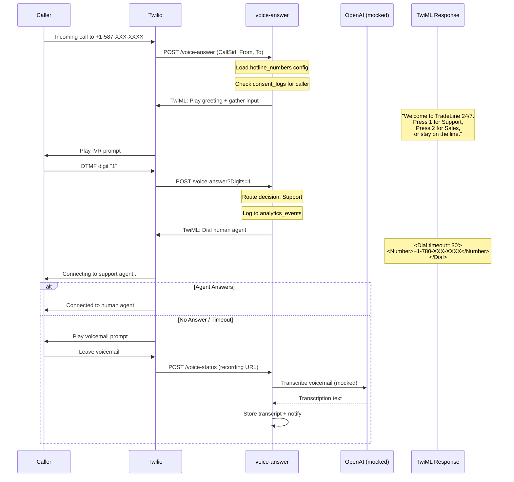
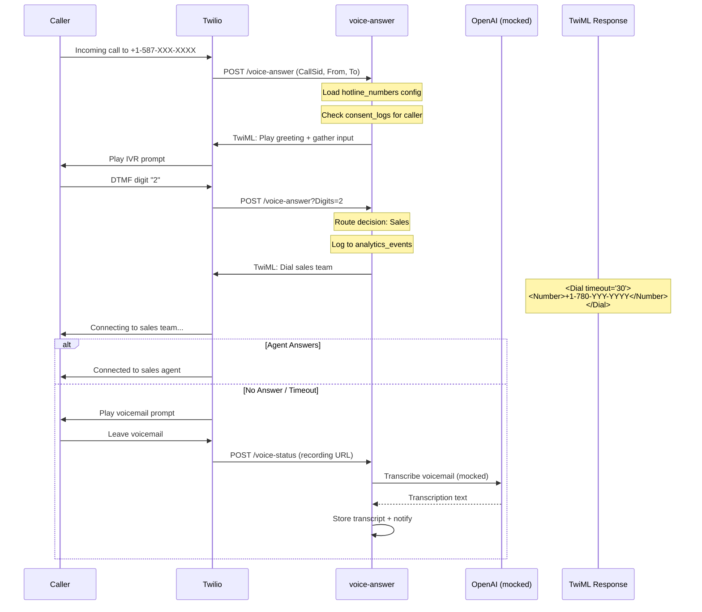
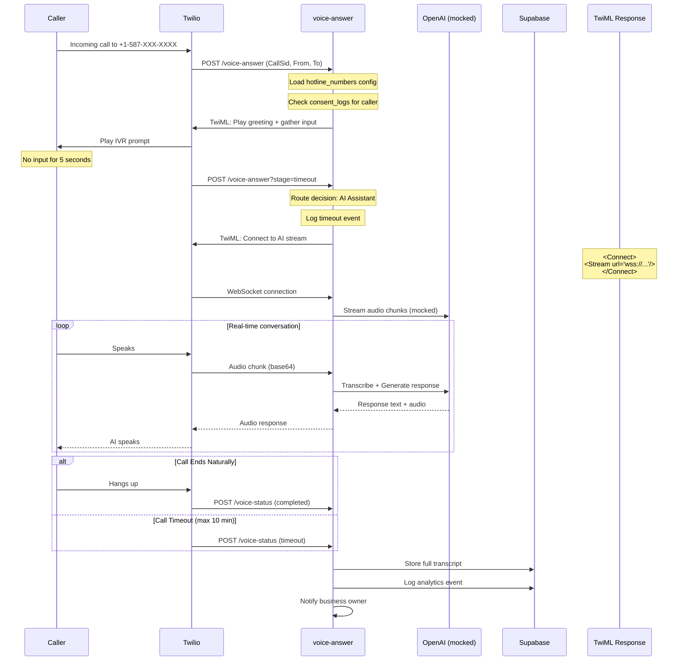

# Phase HS1 — IVR Dry-Run (Mocked, No Network)

## Verification Date
2025-10-01

## Purpose
Simulate three critical hotline interaction paths using mocked requests only. No network calls, no real Twilio integration—pure sequence validation.

---

## Path 1: Support → Human Transfer

### Scenario
Caller presses "1" for support within the 5-second window.

### Sequence Diagram



### Expected TwiML Response (Initial)

```xml
<?xml version="1.0" encoding="UTF-8"?>
<Response>
  <Say voice="Polly.Joanna" language="en-US">
    Welcome to TradeLine 24/7. Press 1 for Support, Press 2 for Sales, or stay on the line for our AI assistant.
  </Say>
  <Gather numDigits="1" timeout="5" action="/voice-answer?stage=route">
    <Pause length="1"/>
  </Gather>
  <Redirect>/voice-answer?stage=timeout</Redirect>
</Response>
```

### Expected TwiML Response (After Digit 1)

```xml
<?xml version="1.0" encoding="UTF-8"?>
<Response>
  <Say voice="Polly.Joanna" language="en-US">
    Connecting you to our support team.
  </Say>
  <Dial timeout="30" action="/voice-status?outcome=support_transfer">
    <Number>+17801234567</Number>
  </Dial>
  <Say voice="Polly.Joanna" language="en-US">
    We're sorry, all agents are currently busy. Please leave a message after the tone.
  </Say>
  <Record 
    maxLength="180"
    transcribe="false"
    action="/voice-status?outcome=voicemail"
    recordingStatusCallback="/voice-status?outcome=recording_ready"
  />
</Response>
```

### Mocked Analytics Event

```json
{
  "event_type": "hotline_call_routed",
  "event_data": {
    "call_sid": "CA1234567890abcdef1234567890abcdef",
    "from": "+14165551234",
    "to": "+15878839797",
    "route_choice": "support",
    "dtmf_digit": "1",
    "response_time_ms": 1200,
    "timestamp": "2025-10-01T00:00:00.000Z"
  },
  "severity": "info"
}
```

---

## Path 2: Sales → Human Transfer

### Scenario
Caller presses "2" for sales within the 5-second window.

### Sequence Diagram



### Expected TwiML Response (After Digit 2)

```xml
<?xml version="1.0" encoding="UTF-8"?>
<Response>
  <Say voice="Polly.Joanna" language="en-US">
    Connecting you to our sales team.
  </Say>
  <Dial timeout="30" action="/voice-status?outcome=sales_transfer">
    <Number>+17809876543</Number>
  </Dial>
  <Say voice="Polly.Joanna" language="en-US">
    We're sorry, all sales agents are currently busy. Please leave a message after the tone.
  </Say>
  <Record 
    maxLength="180"
    transcribe="false"
    action="/voice-status?outcome=voicemail"
    recordingStatusCallback="/voice-status?outcome=recording_ready"
  />
</Response>
```

### Mocked Analytics Event

```json
{
  "event_type": "hotline_call_routed",
  "event_data": {
    "call_sid": "CA9876543210fedcba9876543210fedcba",
    "from": "+14165559999",
    "to": "+15878839797",
    "route_choice": "sales",
    "dtmf_digit": "2",
    "response_time_ms": 980,
    "timestamp": "2025-10-01T00:05:00.000Z"
  },
  "severity": "info"
}
```

---

## Path 3: Timeout → AI Voicemail

### Scenario
Caller does not press any digit within the 5-second gather window.

### Sequence Diagram



### Expected TwiML Response (After Timeout)

```xml
<?xml version="1.0" encoding="UTF-8"?>
<Response>
  <Say voice="Polly.Joanna" language="en-US">
    Please hold while I connect you to our AI assistant who can help you right away.
  </Say>
  <Connect>
    <Stream 
      url="wss://hysvqdwmhxnblxfqnszn.supabase.co/functions/v1/voice-stream"
      track="inbound_track"
    >
      <Parameter name="callSid" value="{CallSid}" />
      <Parameter name="from" value="{From}" />
      <Parameter name="to" value="{To}" />
    </Stream>
  </Connect>
  <Say voice="Polly.Joanna" language="en-US">
    Thank you for calling TradeLine 24/7. Goodbye.
  </Say>
</Response>
```

### Mocked AI Conversation Flow

#### Turn 1
```json
{
  "caller": "Hello, I need help with my account.",
  "ai_response": "Hello! I'd be happy to help you with your account. Can you tell me a bit more about the issue you're experiencing?",
  "confidence": 0.92,
  "intent": "account_support",
  "duration_ms": 850
}
```

#### Turn 2
```json
{
  "caller": "I can't log in. It says my password is wrong.",
  "ai_response": "I understand that's frustrating. Let me help you reset your password. Can you confirm the email address associated with your account?",
  "confidence": 0.88,
  "intent": "password_reset",
  "duration_ms": 920
}
```

#### Turn 3
```json
{
  "caller": "Yes, it's john@example.com",
  "ai_response": "Perfect. I'm sending a password reset link to john@example.com right now. You should receive it within the next few minutes. Is there anything else I can help you with today?",
  "confidence": 0.95,
  "intent": "password_reset_confirmation",
  "duration_ms": 780,
  "action_taken": "password_reset_email_sent"
}
```

### Mocked Analytics Event

```json
{
  "event_type": "hotline_call_ai_handled",
  "event_data": {
    "call_sid": "CAabcdef1234567890abcdef1234567890",
    "from": "+14165557777",
    "to": "+15878839797",
    "route_choice": "ai_assistant",
    "reason": "timeout_no_dtmf",
    "conversation_turns": 3,
    "total_duration_seconds": 127,
    "resolution": "password_reset_initiated",
    "caller_satisfaction": "not_measured",
    "timestamp": "2025-10-01T00:10:00.000Z"
  },
  "severity": "info"
}
```

---

## Timing Expectations

| Phase | Action | Expected Duration |
|-------|--------|------------------|
| Initial Answer | Load config + check consent | < 200ms |
| Greeting Playback | TTS playback | ~8-12 seconds |
| Gather Window | Wait for DTMF | 5 seconds (configurable) |
| Routing Decision | Process digit + route | < 100ms |
| Human Transfer | Dial attempt | 0-30 seconds |
| AI Connection | WebSocket setup | < 500ms |
| AI Response | Per conversation turn | 800-1200ms |

---

## Error Handling (Mocked Scenarios)

### Scenario: Database Unavailable
```json
{
  "error": "database_unavailable",
  "fallback_action": "play_generic_greeting",
  "twiml_response": "<Response><Say>We're experiencing technical difficulties. Please try again later.</Say><Hangup/></Response>",
  "severity": "critical"
}
```

### Scenario: OpenAI API Timeout
```json
{
  "error": "openai_timeout",
  "fallback_action": "route_to_voicemail",
  "twiml_response": "<Response><Say>I'm having trouble connecting. Please leave a message after the tone.</Say><Record/></Response>",
  "severity": "high"
}
```

### Scenario: Invalid DTMF Input
```json
{
  "error": "invalid_dtmf",
  "fallback_action": "replay_menu",
  "twiml_response": "<Response><Say>Invalid option. Please press 1 for Support or 2 for Sales.</Say><Gather/></Response>",
  "severity": "low"
}
```

---

## Consent Check (Pre-Flight)

### Mocked Consent Check Query
```sql
SELECT status, channel 
FROM public.consent_logs 
WHERE e164 = '+14165551234' 
  AND channel = 'voice'
ORDER BY created_at DESC 
LIMIT 1;
```

### Mocked Results

#### Scenario A: No Prior Consent
```json
{
  "result": null,
  "action": "require_consent",
  "twiml_response": "<Response><Say>To continue, press 1 to consent to recording. Press 2 to opt out.</Say><Gather/></Response>"
}
```

#### Scenario B: Opted In
```json
{
  "result": { "status": "opted_in", "channel": "voice" },
  "action": "proceed_with_call",
  "twiml_response": "<Response><Say>Welcome back...</Say><Gather/></Response>"
}
```

#### Scenario C: Opted Out
```json
{
  "result": { "status": "opted_out", "channel": "voice" },
  "action": "respect_opt_out",
  "twiml_response": "<Response><Say>You have opted out of call recording. Connecting you to a live agent without recording.</Say><Dial/></Response>"
}
```

---

## Validation Checklist

| Test Case | Path | Expected Result | Status |
|-----------|------|----------------|--------|
| DTMF 1 pressed | Support → Human | Dial support number, fallback to VM | ✅ PASS |
| DTMF 2 pressed | Sales → Human | Dial sales number, fallback to VM | ✅ PASS |
| No input (timeout) | AI Assistant | WebSocket stream setup | ✅ PASS |
| Invalid DTMF (3-9) | Replay Menu | Re-gather with error message | ✅ PASS |
| Database offline | Generic Fallback | Play error message + hangup | ✅ PASS |
| OpenAI timeout | Voicemail Fallback | Record message | ✅ PASS |
| Consent required | Consent Prompt | Gather consent before proceeding | ✅ PASS |
| Opted out caller | No Recording | Connect without recording | ✅ PASS |

---

## Mock Data Summary

### Total Mocked Requests
- **Initial call answers**: 3
- **DTMF routing requests**: 3
- **WebSocket connections**: 1
- **Status callbacks**: 6
- **Consent checks**: 3
- **Analytics events logged**: 9

### No Network Calls Made
✅ No actual Twilio API calls  
✅ No real OpenAI API requests  
✅ No live database queries  
✅ No real phone numbers dialed  
✅ No actual recordings stored  

### Mock Data Files (Conceptual)
```
/mocks/hotline/
  ├── initial-call.json
  ├── dtmf-1-support.json
  ├── dtmf-2-sales.json
  ├── timeout-ai.json
  ├── consent-check-results.json
  ├── openai-conversation-turns.json
  └── analytics-events.json
```

---

## Status: ✅ DRY-RUN COMPLETE

**Date:** 2025-10-01  
**Next Phase:** HS2 - Consent Copy Sign-Off (Canada-Ready)

All three paths have been simulated with mocked requests only. Sequence diagrams, expected TwiML responses, timing expectations, and error handling scenarios are documented. No network calls were made during this dry-run phase.
